# 🌊 SKANN-SSL: Selective Kernel Audio Neural Networks with Self-Supervised Learning

<div align="center">

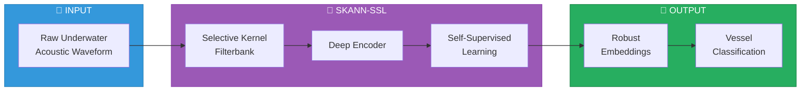

**An underwater acoustic vessel detection and classification system using physics-aware self-supervised learning**


SKANN-SSL learns vessel signatures directly from raw waveforms using selective-kernel filterbanks and produces robust embeddings for downstream evaluation and inference.

</div>

---

## 🎯 Project Status (V3/V5 — Production)

```mermaid
graph LR
    subgraph Pipeline["🔄 SKANN-SSL PIPELINE"]
        direction LR
        S1["Stage -1<br/>📊 Synthetic Data<br/>✅ Complete"]
        S0["Stage 0<br/>⚙️ Preprocessing<br/>✅ Complete"]
        S1K["Stage 1<br/>🎛️ SKConv1D<br/>✅ Implemented"]
        S2["Stage 2<br/>🧠 Encoder<br/>✅ Complete"]
        S3["Stage 3<br/>🔗 SSL Training<br/>✅ Complete"]
        S4["Stage 4<br/>🎨 Augmentation<br/>⏳ Planned"]
        S5["Stage 5<br/>🏋️ Training Loop<br/>✅ Complete"]
        S6["Stage 6<br/>📈 Evaluation<br/>✅ Complete"]
        S7["Stage 7<br/>🚀 Deployment<br/>✅ Prototype"]
    end
    
    S1 --> S0 --> S1K --> S2 --> S3 --> S4 --> S5 --> S6 --> S7
    
    style S1 fill:#27ae60,stroke:#1e8449,color:#fff
    style S0 fill:#27ae60,stroke:#1e8449,color:#fff
    style S1K fill:#27ae60,stroke:#1e8449,color:#fff
    style S2 fill:#27ae60,stroke:#1e8449,color:#fff
    style S3 fill:#27ae60,stroke:#1e8449,color:#fff
    style S4 fill:#f39c12,stroke:#d68910,color:#fff
    style S5 fill:#27ae60,stroke:#1e8449,color:#fff
    style S6 fill:#27ae60,stroke:#1e8449,color:#fff
    style S7 fill:#3498db,stroke:#2980b9,color:#fff
```

| Stage | Name | Status | Description |
|------:|------|:------:|-------------|
| -1 | Synthetic Data | ✅ Complete | Physics-based waveform generator (V5) |
| 0 | Preprocessing | ✅ Complete | DataLoader, normalisation, splits |
| 1 | SKConv1D Filterbank | ✅ Implemented | Multi-branch learned filterbank |
| 2 | Encoder | ✅ Complete | HybridSKEncoderV3 with SK frontend |
| 3 | SSL Training | ✅ Complete | Barlow Twins (V3 production) |
| 4 | Augmentation | ⏳ Planned | Physics-consistent augmentations |
| 5 | Training Loop | ✅ Complete | Integrated with Stage 3 |
| 6 | Evaluation | ✅ Complete | Confusion matrix + territory mapping |
| 7 | Deployment | ✅ Prototype | Local inference engine + demo GUI |

---

## 🏆 Key Results (V3/V5 — Near-Perfect Classification)

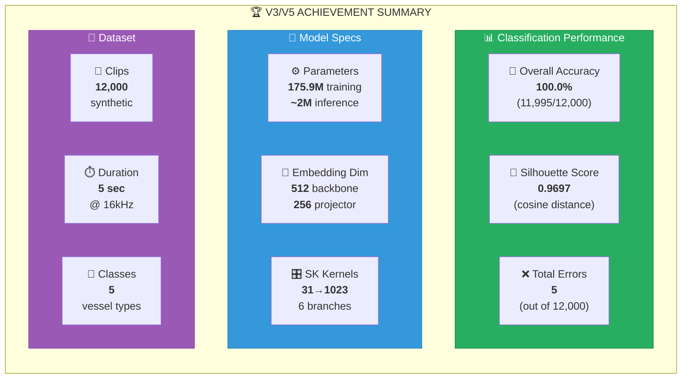

<div align="center">

| Metric | Value |
|--------|------:|
| **Overall Accuracy** | **100.0% (11,995/12,000)** |
| **Silhouette Score (cosine)** | **0.9697** |
| **Classes** | 5 (cargo, fishing, no_vessel, small_craft, tanker) |
| **Total Errors** | 5 |
| **Model Parameters** | 175.9M (training) / ~2M (inference) |
| **Embedding Dimension** | 512 (backbone) / 256 (projector) |
| **Training Hardware** | Google Colab A100 |
| **Dataset Size** | 12,000 synthetic clips (5 seconds each) |
| **SK Kernels** | (31, 63, 127, 255, 511, 1023) |
| **Frequency Coverage** | 15 Hz – 500+ Hz |

</div>

---

## 📈 Version History & Evolution

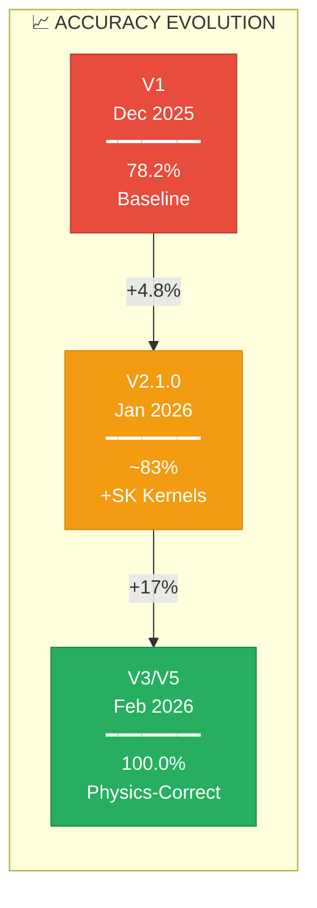

| Version | Date | Accuracy | Silhouette | Key Change |
|---------|------|----------|------------|------------|
| V1 | Dec 2025 | 78.2% | 0.3997 | Baseline (no SK) |
| V2.1.0 | Jan 2026 | ~83% | 0.8299 | SK kernels added |
| **V3/V5** | **Feb 2026** | **100.0%** | **0.9697** | **Physics-correct dataset** |

---

## 🏗️ Architecture (V3)

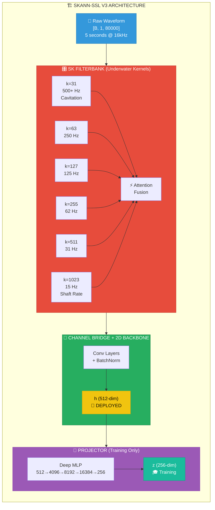

---

## 🎛️ Selective Kernel Coverage

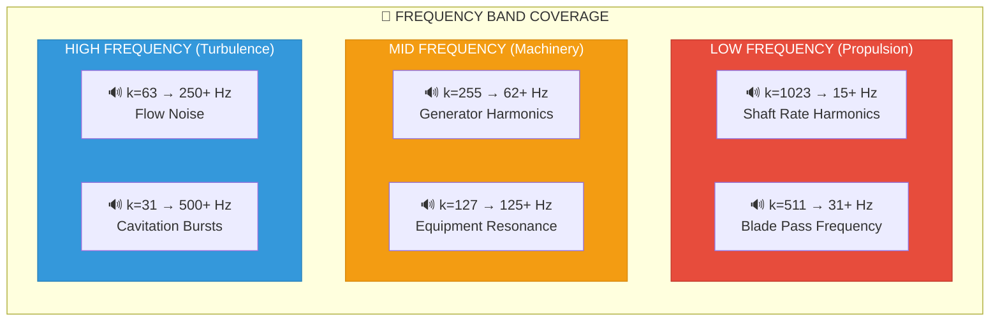

---

## 📂 Project Structure

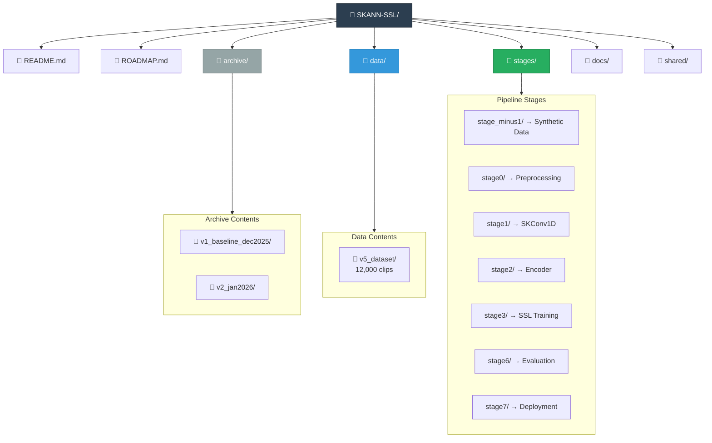

```text
SKANN-SSL/
├── README.md
├── ROADMAP.md
│
├── archive/
│   ├── v1_baseline_dec2025/     # Archived V1 baseline
│   └── v2_jan2026/              # Archived V2.1.0
│
├── data/
│   └── v5_dataset/              # 12,000 clips (5 classes)
│       ├── tensors/
│       ├── waveforms/
│       └── master_dataset_manifest.csv
│
├── stages/
│   ├── stage_minus1/            # Synthetic data generation
│   ├── stage0_preprocessing/    # DataLoader
│   ├── stage1_skconv1d/         # SK filterbank
│   ├── stage2_encoder/          # Encoder architecture
│   ├── stage3_ssl/              # SSL training + artifacts
│   │   ├── train_script.py      # Model architecture
│   │   └── artifacts/
│   │       ├── SKANN_SSL_V3_Production_Bundle.joblib
│   │       └── vessel_territories_v3.joblib
│   ├── stage6_evaluation/       # Confusion matrix + classifier
│   └── stage7_deployment/
│
├── docs/
└── shared/
```

---

## 🚀 Quick Start

### Stage 6 — Batch Evaluation (Confusion Matrix)
```bash
cd SKANN-SSL
python stages/stage6_evaluation/stage6_confusion_matrix.py
```

### Stage 6 — Interactive Classifier
```bash
cd SKANN-SSL
python stages/stage6_evaluation/stage6_acoustic_sonar_classifier.py
```

### Demo GUI (Separate Repository)
```bash
git clone https://github.com/suniltyagialtair/SKANN-SSL-V5-Demo
cd SKANN-SSL-V5-Demo
python skann_ssl_v5_demo.py
```

---

## 📊 V3/V5 Confusion Matrix

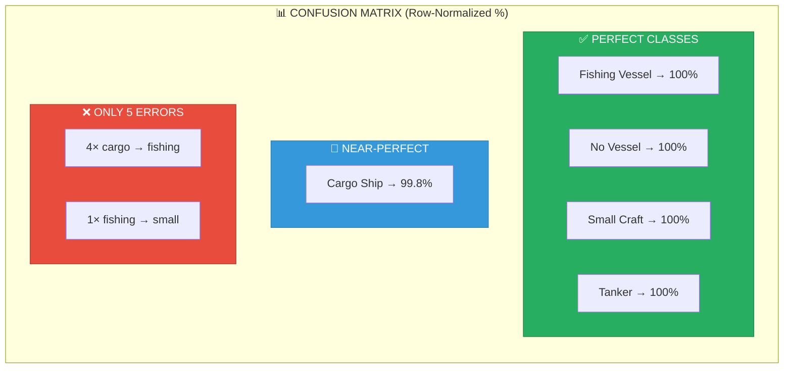

```text
              cargo  fishing  no_vessel  small   tanker
cargo         99.8    0.2       0.0      0.0     0.0
fishing        0.0  100.0       0.0      0.0     0.0
no_vessel      0.0    0.0     100.0      0.0     0.0
small          0.0    0.0       0.0    100.0     0.0
tanker         0.0    0.0       0.0      0.0   100.0
```

⚠️ **Only 5 errors** across 12,000 clips:
- 4× cargo_ship → fishing_vessel
- 1× fishing_vessel → small_craft

---

## 🔬 Why V3/V5 Succeeded

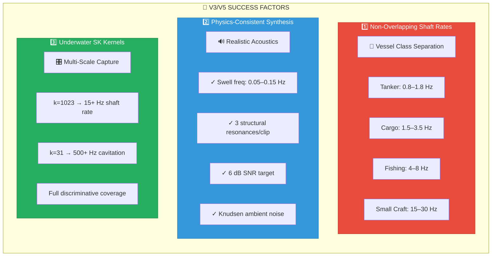

### 1. Non-Overlapping Shaft Rate Ranges (V5 Dataset)

| Class | Shaft Rate Range | RPM Range |
|-------|------------------|-----------|
| 🚢 Tanker | 0.8–1.8 Hz | 48–108 RPM |
| 🚢 Cargo ship | 1.5–3.5 Hz | 90–210 RPM |
| 🎣 Fishing vessel | 4–8 Hz | 240–480 RPM |
| 🚤 Small craft | 15–30 Hz | 900–1800 RPM |

### 2. Physics-Consistent Synthesis
- ✅ Corrected swell frequency (0.05–0.15 Hz)
- ✅ Exactly 3 structural resonances per clip
- ✅ 6 dB SNR between vessel and ambient noise
- ✅ Realistic Knudsen-curve ambient noise

### 3. Underwater-Appropriate SK Kernels
- 🎛️ k=1023 captures shaft rate (15+ Hz)
- 🎛️ k=31 captures cavitation (500+ Hz)
- 🎛️ Full coverage of discriminative frequency bands

---

## 📦 Related Repositories

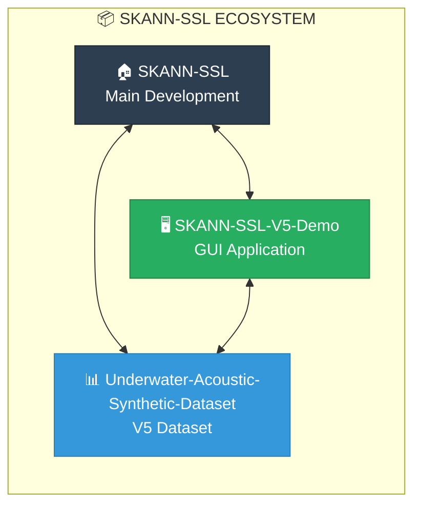

| Repository | Description |
|------------|-------------|
| [SKANN-SSL](https://github.com/suniltyagi/SKANN-SSL) | Main development repo |
| [SKANN-SSL-V5-Demo](https://github.com/suniltyagialtair/SKANN-SSL-V5-Demo) | GUI demo application |
| [Underwater-Acoustic-Synthetic-Dataset](https://github.com/suniltyagialtair/Underwater-Acoustic-Synthetic-Dataset) | V5 dataset (12,000 clips) |

---

## 📦 Historical Versions

| Version | Location | Notes |
|---------|----------|-------|
| V1 (Dec 2025) | `archive/v1_baseline_dec2025/` | 78.2% accuracy, no SK |
| V2.1.0 (Jan 2026) | `archive/v2_jan2026/` | 0.8299 silhouette, 1,920 clips |

---

## 🔮 Roadmap

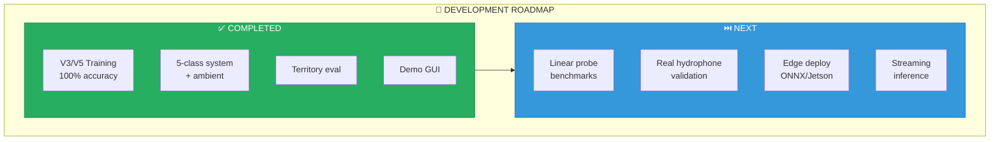

### ✅ Completed
- V3/V5 Physics-aware training (100% accuracy)
- 5-class system including ambient noise detection
- Territory-based evaluation
- Demo GUI application

### ⏭️ Next
- Linear probe benchmarking
- Real hydrophone validation (ShipEar, NOAA)
- Edge deployment (ONNX / Jetson)
- Streaming inference

---

## 🧪 V3/V5 Experiment Provenance

<details>
<summary>📋 Full Provenance Details</summary>

**Experiment ID:** `V3_V5_colab_a100`

**Execution Platform:**
- Google Colab (A100 GPU)
- Single GPU training

**Training Regime:**
- Self-supervised learning using **Barlow Twins**
- Physics-aware **Selective Kernel (SK) filterbank**
- 51 epochs, batch size 4

**Data Regime:**
- V5 synthetic underwater acoustic dataset
- 12,000 clips, 5 seconds each @ 16kHz
- 5 vessel classes (including no_vessel/ambient)
- Non-overlapping shaft rate ranges for acoustic distinguishability

**Evaluation:**
- Primary metric: **Silhouette score (cosine)** = **0.9697**
- Classification accuracy: **100.0%** (11,995/12,000)
- kNN accuracy: **100%**

**Production Bundle:**
```
stages/stage3_ssl/artifacts/SKANN_SSL_V3_Production_Bundle.joblib
```

</details>

---

<div align="center">

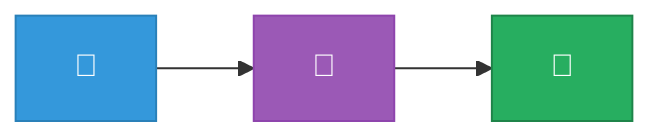

**Made with 🎧 for underwater acoustics research**

*Last updated: February 2026*

</div>
