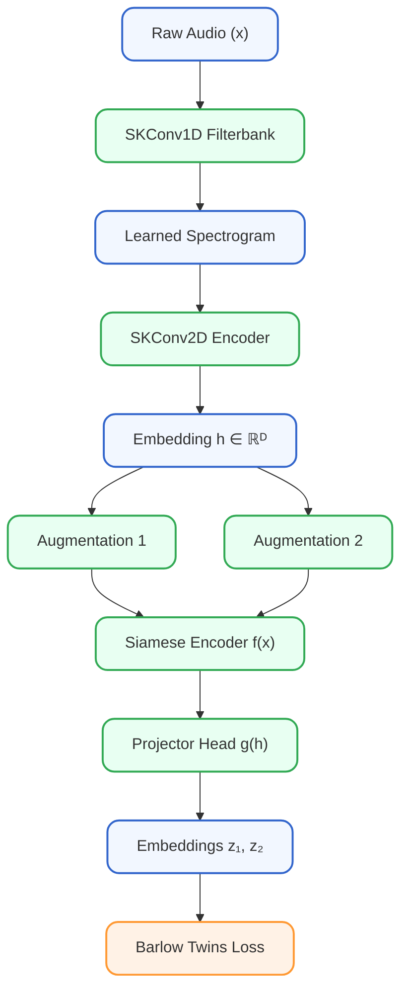

# PROJECT ROADMAP  
## Hybrid Selective Kernel Self-Supervised Acoustic Representation Learning System

---

## 1. Initial Sample Creation (Stage −1)

**Objective:**  
Provide raw waveform inputs for the system before Stage 0 begins.  
This stage is external to the main ML pipeline and is part of the Dataset Plan (non-pipeline).

**Tasks:**  
Generate synthetic vessel-noise waveforms using a Python-based generator.

- Produce physics-inspired acoustic signatures including blade-rate tonals, multi-harmonics, broadband propulsion noise, cavitation bursts, and Doppler-induced warping.
- Save the generated signals as `.wav` files at the standard sampling rate of 16 kHz.
- Organise the synthetic dataset into labeled vessel-type folders.

**Output:**  
A set of initial waveform files (e.g., `.wav`) ready for ingestion by Stage 0 (Preprocessing).

**Note:**  
This stage does not replace real-world datasets. It exists to support early debugging, model bring-up, augmentation testing, and baseline evaluation before integrating NOAA, MBARI, JAMSTEC, or DCLDE datasets.

---

## 2. Stage 0 — Preprocessing & Data Standardisation

**Objective:**  
Ensure all raw signals are consistent, normalised, and ready for model ingestion.

**Tasks:**
- Resample audio to a fixed sampling rate.
- Remove DC offset.
- Apply amplitude normalisation.
- Optional high-pass filter.
- Silence trimming / energy-gated cropping.
- Segment into fixed-length clips.

**Output:**  
Tensor `[Batch, 1, T]`

---

## 3. Stage 1 — Learned Filterbank (Raw Waveform Front-End)

**Objective:**  
Replace STFT/mel spectrogram preprocessing with a learned multi-scale time-domain filterbank.

**Design:**
- Multi-branch SKConv1D with kernels (3, 5, 7, 11, 15).
- Optional dilated kernels.
- Optional initial Conv1D (kernel 512, stride 256).

**Output:**  
`[B, F, T1]` learned time–feature map.

**Phenomena Captured:**  
Transients, tonals, modulation, broadband noise.

---

## 4. Stage 2 — Hierarchical 2D Acoustic Encoder

**Objective:**  
Convert learned time–feature maps into high-level 2D embeddings.

**Workflow:**
- Reshape `[B, F, T1] → [B, 1, F, T1]`
- Apply SKConv2D blocks
- Global pooling
- Linear projection to `h ∈ ℝᴰ`

---

## 5. Stage 3 — Self-Supervised Representation Learning (SSL)

**Objective:**  
Train the encoder without labels using self-supervised learning.

**Components:**
- Siamese encoder with shared weights.
- Projector head `g(h)`.
- Barlow Twins loss (invariance + decorrelation).
- Optional alternatives: SimCLR, VICReg.

---

## 6. Stage 4 — Data Pipeline & Augmentation Engine

**Objective:**  
Generate physics-consistent positive pairs.

**Augmentations:**
- Random crop
- Time shift
- Gain jitter
- Gaussian noise
- Band-pass / low-pass filters
- Time masking
- Optional frequency masking

> This is a **supporting, non-linear stage** that feeds Stage 3.

---

## 7. Stage 5 — Training, Embedding Extraction & Clustering

**Training Loop:**  
Augment → Encode → Project → Loss → Update

**Post-training:**
- Discard projector
- Optional PCA / whitening

**Clustering:**
- HDBSCAN (preferred)
- DBSCAN (alternative)

**Visualisation:**  
UMAP, t-SNE, cluster averages.

---

## 8. Stage 6 — Optional / Recommended Extensions

- Evaluation & analytics
- Embedding variance diagnostics
- Invariance robustness tests
- Correlation heatmaps

---

## 9. Stage 7 — Deployment & Export

- ONNX export for embedded inference
- Optional quantisation
- Deployment to ARM / DSP hardware

---

## 10. Deliverables (Non-Pipeline)

- SKConv1D implementation
- SKConv2D implementation
- HybridSKEncoder
- SSL wrapper
- Augmentation engine
- Training pipeline
- Clustering utilities
- ONNX export
- Full TDD

---

## 11. Dataset Plan (Non-Pipeline)

For initial testing, the system will use a Synthetic Vessel Noise Generator implemented in Python.  
This generator produces physics-inspired vessel acoustic signatures (blade-rate tonals, broadband noise, cavitation bursts, Doppler-shifted modulations), enabling controlled validation of the SKConv1D and SKConv2D architecture.

For subsequent evaluation using real-world underwater acoustic signals, the following publicly accessible datasets will be used:

- NOAA NCEI Passive Acoustic Archives – Real hydrophone recordings containing vessel noise.
- MBARI Hydrophone Dataset – Includes vessel pass-bys, maritime traffic, and ambient underwater noise.
- JAMSTEC Underwater Observatory Recordings – Long-term hydrophone deployments with merchant ship noise.
- DCLDE Workshop Datasets – Include mixed marine mammal and vessel acoustic events suitable for SSL validation.

These datasets provide diverse underwater vessel noise signatures required for unsupervised clustering, embedding evaluation, and robustness benchmarking.

---

## 12. Flowchart Diagram

(See **System Flowchart (Authoritative)**.)

---

## 13. Summary & Conclusion (Non-Pipeline)

A complete, modern, scalable self-supervised acoustic representation learning system.  
Suitable for sonar, HAVS, machinery vibration, and environmental acoustics.  
Industry-grade and implementation-ready.
