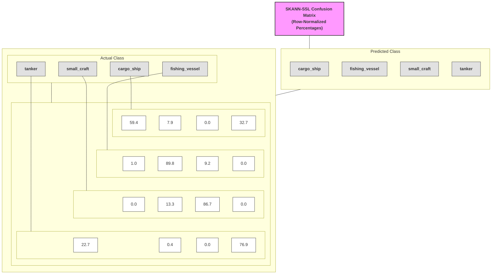

# ✅ `stages/stage6_evaluation/CONFUSION_MATRIX_ANALYSIS.md`

# Stage 6 — Confusion Matrix Analysis

## Purpose

The confusion matrix is the **primary diagnostic instrument** in Stage 6.

Its role is **not merely to report accuracy**, but to evaluate how the
SKANN-SSL encoder has organised vessel acoustics in its learned embedding
space.

Specifically, it is used to determine:

1. which vessel classes are acoustically well separated
2. which classes are systematically confused, and in which direction
3. whether confusions are symmetric or asymmetric
4. whether misclassifications are physically plausible

---

## What the Confusion Matrix Represents

The confusion matrix used in Stage 6 is **row-normalised**.

- **Rows** → actual (ground-truth) vessel class  
- **Columns** → predicted vessel class  
- **Each row sums to 100 %**

Each row answers the question:

> *“Given a vessel of this true class, how does the system classify it?”*

Row-normalisation removes dataset-imbalance effects and focuses on **recall
and confusion structure**, which are operationally meaningful.

---

## Interpreting the Diagonal

Diagonal elements represent **per-class recall**.

| Class           | Recall (%) | Interpretation                               |
|-----------------|------------|----------------------------------------------|
| Fishing vessel  | 89.8       | Highly distinctive acoustic signature        |
| Small craft     | 86.7       | Strong separation                            |
| Tanker          | 76.9       | Moderate separation with structured overlap  |
| Cargo ship      | 59.4       | Weakest separation                           |

A darker diagonal cell indicates stronger class identity in the embedding
space.

---

## Off-Diagonal Structure (Meaningful Confusion)

Off-diagonal values encode **acoustic similarity**, not random error.

### Example: Cargo ship → Tanker (32.7 %)

When the true vessel is a cargo ship, the model predicts tanker nearly
one-third of the time.

This is:
- physically plausible
- expected for large, steel-hulled, slow-speed vessels
- dominated by overlapping low-frequency propulsion and cavitation bands

---

## Asymmetry Matters

Confusions are **directional**:

- Cargo → Tanker: 32.7 %
- Tanker → Cargo: 22.7 %

This asymmetry indicates:
- cargo ships occupy a broader acoustic territory
- tankers form a tighter, more compact cluster
- some cargo signatures fall inside tanker territory, but not vice-versa

This behaviour directly motivates the **territory-centroid abstraction**
used downstream.

---

## Clean Separation Cases

Near-zero confusions are observed between:
- large merchant vessels and small craft
- tanker and small craft

This confirms that:
- scale, blade rate, and cavitation regime dominate representation
- the SSL encoder has learned physically meaningful invariants

---

## Role of the Colour Map

The colour scale encodes **conditional probability**:

- darker shades → dominant acoustic hypothesis
- lighter shades → secondary hypotheses

Operators can visually assess:
- confidence concentration (sharp diagonal)
- ambiguity (probability spread across columns)

---

## Why Row-Normalised (Not Raw Counts)

Raw confusion matrices are biased by class population.

Row-normalisation answers the operational question:

> *“Given this vessel type, how will the system behave?”*

This is critical for:
- surveillance
- cueing
- operator trust calibration

---

## Implications for the Pipeline

- **Stage 6** uses the confusion matrix to:
  - validate embedding quality
  - derive vessel territories and centroids
  - identify physically meaningful ambiguities

- **Stage 7** will:
  - consume centroid mappings
  - apply confidence and ambiguity thresholds
  - optionally expose top-N hypotheses to operators

---

## Executive Summary

The Stage-6 confusion matrix demonstrates that SKANN-SSL learns acoustically
meaningful vessel representations, with strong separation for fishing vessels
and small craft, and physically plausible, asymmetric confusion between large
merchant classes such as cargo ships and tankers.

---

## Appendix A — Confusion Matrix Layout (Mermaid)

> Note: Mermaid rendering depends on the Markdown viewer (GitHub supports Mermaid).
> This diagram is a schematic representation of the row-normalised confusion matrix
> shown in `artifacts/confusion_matrix.png`.

**Interpretation note**

This Mermaid diagram is a **schematic representation** of the Stage-6 confusion
matrix. It is intended to clarify the **logical layout and semantics** of the
matrix—actual class (rows), predicted class (columns), and row-normalised
percentages—rather than to convey quantitative detail through colour intensity.

The **authoritative quantitative visualisation** is the rendered heatmap stored
as:

`artifacts/confusion_matrix.png`

Operators and analysts should rely on the heatmap for:
- probability magnitude
- relative confidence across classes
- visual salience of dominant confusions

The Mermaid diagram serves as a **structural aid**, especially when reading this
analysis in plain-text or non-graphical Markdown environments.