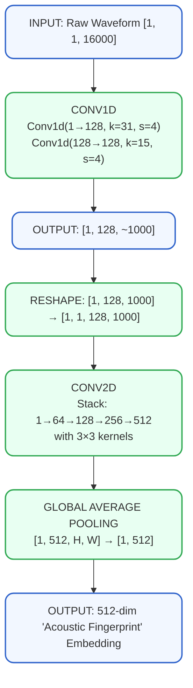
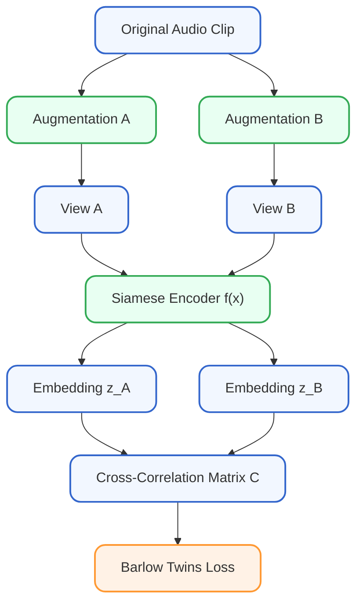

```
SKANN-SSL

Neural Network Architecture & Self-Supervised Learning
Technical Reference Guide
```
---
---

# SKANN-SSL  
## Neural Network Architecture & Self-Supervised Learning  
**Technical Reference Guide**  
*December 2025*

---

## Part 1: Convolution Fundamentals

### 1.1 What is a Kernel?

A **kernel** (also called filter) is a small sliding window of learnable numbers that moves across your data looking for patterns. Think of it as a pattern detector that the neural network learns during training.

#### Analogy:

| Kernel Is Like...     | Description |
|-----------------------|-------------|
| Magnifying glass      | Slides across a page, examining small portions at a time |
| Stencil               | A template that matches specific patterns |
| Metal detector        | Sweeps across ground, activating when it finds metal |

#### What a Kernel Looks Like:

A kernel with size 5:


┌─────────────────────────────────┐
│  w₁    w₂    w₃    w₄    w₅     │
│ 0.3  -0.5   0.8  -0.2   0.1     │  ← These 5 numbers are LEARNED
└─────────────────────────────────┘


These weights are adjusted during training.  
Different kernels learn to detect different patterns.

---

### 1.2 What is Kernel Size?

Kernel size determines how many consecutive samples the sliding window examines at once. For audio at 16 kHz sampling rate:

| Kernel Size | Duration (@ 16kHz) | Detects                     |
|-------------|--------------------|-----------------------------|
| 3           | 0.19 ms            | Very fast transients, clicks|
| 7           | 0.44 ms            | Sharp attacks               |
| 15          | 0.94 ms            | Tonal features              |
| 31          | 1.94 ms            | Frequency patterns, harmonics|
| 63          | 3.94 ms            | Longer modulations          |
| 127         | 7.94 ms            | Slow envelope changes       |

**Key Insight:** Larger kernel = sees more context = detects slower/longer patterns

---

### 1.3 What is Stride?

Stride determines how far the kernel moves after each calculation. It controls the output size.

#### STRIDE = 1 (default):

```
Position 1:  [■ ■ ■ ■ ■]░ ░ ░ ░ ░    → Output 1
Position 2:  ░[■ ■ ■ ■ ■]░ ░ ░ ░    → Output 2
Position 3:  ░ ░[■ ■ ■ ■ ■]░ ░ ░    → Output 3

Output length ≈ Input length (almost same size)
```

#### STRIDE = 4:

```
Position 1:  [■ ■ ■ ■ ■]░ ░ ░ ░ ░ ░ ░    → Output 1
Position 2:  ░ ░ ░ ░[■ ■ ■ ■ ■]░ ░ ░    → Output 2
Position 3:  ░ ░ ░ ░ ░ ░ ░ ░[■ ■ ■ ■ ■] → Output 3

Output length ≈ Input length ÷ 4
```

**Output Size Formula:**

Output Length = floor((Input Length - Kernel Size) / Stride) + 1


---

### 1.4 What is Batch Size?

Batch size determines how many audio clips are processed together in one forward pass through the network.

#### BATCH SIZE = 1:

```
┌──────────────────────────┐
│  Clip 1 (16000 samples)  │ → Network → Result 1
└──────────────────────────┘
```
#### BATCH SIZE = 4:

```
┌──────────────────────────┐
│  Clip 1 (16000 samples)  │ ─┐
├──────────────────────────┤  │
│  Clip 2 (16000 samples)  │  ├→ Network → [Result 1, 2, 3, 4]
├──────────────────────────┤  │     (all at once)
│  Clip 3 (16000 samples)  │  │
├──────────────────────────┤  │
│  Clip 4 (16000 samples)  │ ─┘
└──────────────────────────┘
```

| Batch Size | Pros                     | Cons                     |
|------------|--------------------------|--------------------------|
| 1          | Low memory, real-time    | Slow training, noisy gradients |
| 4–8        | Good for small GPUs      | Moderate speed           |
| 32–64      | Fast training, stable gradients | Needs more GPU memory |
| 128+       | Very fast training       | Needs large GPU          |

---

### 1.5 What are Channels?

Channels represent different feature detectors. Each channel is the output of a different kernel, each detecting a different pattern.

**INPUT:** `[1, 1, 16000]` (1 channel – mono audio)

```
                    ┌─────────────────────────────────┐
                    │  128 DIFFERENT KERNELS          │
                    │  (each with 31 weights)         │
                    │                                 │
Kernel 1:           │  [w₁ w₂ ... w₃₁] → detects     │ → Channel 1
"Low frequency      │   low-frequency patterns       │
 detector"          │                                 │
                    │                                 │
Kernel 2:           │  [w₁ w₂ ... w₃₁] → detects     │ → Channel 2
"High frequency     │   high-frequency patterns      │
 detector"          │                                 │
                    │                                 │
...                 │  (126 more kernels)             │
                    │                                 │
Kernel 128:         │  [w₁ w₂ ... w₃₁] → detects     │ → Channel 128
"Cavitation         │   cavitation-like bursts       │
 detector"          └─────────────────────────────────┘
```

**OUTPUT:** `[1, 128, ~4000]` (128 channels)

---

## Part 2: Tensor Shape Notation

### 2.1 Understanding [B, C, T] Notation

**Input shape:** `[B, C, T]`  
- `B` = Batch size  
- `C` = Channels  
- `T` = Time samples  

**Examples:**

- `[1, 1, 16000]` = Batch of 1 clip, 1 channel, 16000 samples  
- `[4, 1, 16000]` = Batch of 4 clips, 1 channel, 16000 samples each  
- `[32, 1, 16000]` = Batch of 32 clips (typical training batch)

---

### 2.2 Dimensionality Reduction Example

How 16000 samples become ~1000 time steps through two convolutional layers:

**INPUT:** 16000 samples

**LAYER 1:** `Conv1d(kernel=31, stride=4)`  
```
Output = floor((16000 - 31) / 4) + 1  
       = floor(15969 / 4) + 1  
       = 3992 + 1 = 3993 samples
```

**LAYER 2:** `Conv1d(kernel=15, stride=4)`  
```
Output = floor((3993 - 15) / 4) + 1  
       = floor(3978 / 4) + 1  
       = 994 + 1 = 995 samples ≈ 1000
```

✅ **Final:** ~1000 time steps

---

## Part 3: Audio Neural Networks

### 3.1 Conv1D — "The Ear"

Conv1D processes raw audio waveforms directly, learning to detect temporal patterns like different frequency bands, transients, and harmonics.

**INPUT:** Raw audio waveform  
`[1, 1, 16000]` → 16000 samples of pressure over time

**CONV1D PROCESSING:**
```
Audio: ∿∿∿∿∿∿∿∿∿∿∿∿∿∿∿∿∿∿∿∿∿∿∿∿∿∿∿∿∿∿∿∿∿∿∿∿∿∿∿∿∿∿∿∿∿∿∿∿∿∿∿∿∿∿
       ▲───────────────────────────────▲
              Kernel (31 samples)
              slides across waveform
```
```
**OUTPUT:** `[1, 128, ~4000]`  
128 feature channels × ~4000 time steps

**What Conv1D learns to detect:**
- Sharp transients (clicks, impulses)
- Tonal onsets
- Frequency patterns
- Harmonics

---

### 3.2 Conv2D — "The Brain's Auditory Cortex"

Conv2D processes the output of Conv1D as if it were an image, with channels as the vertical axis and time as the horizontal axis.

**RESHAPE: 1D → 2D**  
`[1, 128, 1000]` → `[1, 1, 128, 1000]`

Now it looks like a 128×1000 grayscale "image":

```
                              Time (Width) →
                    ┌─────────────────────────────────┐
                  ↑ │ ████░░████████░░░████████████░░ │
    "Frequency"   │ │ ░░████░░░░████████░░░░████░░███ │
     (Height)     │ │ ██░░██████░░░░████░░████░░░░███ │
                  ↓ │ ░░░░████████████░░████████░░░░░ │
                    └─────────────────────────────────┘
```

**CONV2D applies 3×3 kernels that detect:**
- Horizontal patterns → sustained tones  
- Vertical patterns → transients/impulses  
- Diagonal patterns → frequency sweeps (Doppler)  
- Blobs/textures → broadband noise, cavitation

---

### 3.3 Complete Data Flow



---

## Part 4: Selective Kernel Networks (SKConv)

### 4.1 The Problem with Single Kernel

Different acoustic features need different time scales. A single kernel size is always a compromise:

**SHIP NOISE CONTAINS:**

- **Fast features** (need small kernel):  
  • Cavitation clicks: 0.1–0.5 ms  
  • Transient impulses: 0.2–1 ms  
  • High-frequency tonals: short period  

- **Slow features** (need large kernel):  
  • Shaft rotation: 500 ms period (2 Hz)  
  • Low-frequency rumble: 50–100 ms patterns  
  • Amplitude modulation: 100+ ms  

**SINGLE KERNEL = COMPROMISE (k=31 ~2 ms):**  
✅ Good for mid-range features  
❌ Too coarse for fast transients  
❌ Too fine for slow modulations

---

### 4.2 Selective Kernel Solution

SKConv uses multiple kernel sizes in parallel, with an attention mechanism that learns which kernels are most useful for each input:

```
Input ──────────────────────────────────────────────────────────
         │
         ├────────────┬────────────┬────────────┬────────────┐
         ▼            ▼            ▼            ▼            ▼
    ┌─────────┐  ┌─────────┐  ┌─────────┐  ┌─────────┐  ┌─────────┐
    │  k = 3  │  │  k = 5  │  │  k = 7  │  │  k = 11 │  │  k = 15 │
    │ (0.2ms) │  │ (0.3ms) │  │ (0.4ms) │  │ (0.7ms) │  │ (0.9ms) │
    └────┬────┘  └────┬────┘  └────┬────┘  └────┬────┘  └────┬────┘
         │            │            │            │            │
         └────────────┴─────┬──────┴────────────┴────────────┘
                            │
                            ▼
                 ┌─────────────────────────┐
                 │    ATTENTION FUSION     │
                 │                         │
                 │  "Which kernel size is  │
                 │   best for THIS input?" │
                 │                         │
                 │  α₁ = 0.15  (k=3)       │
                 │  α₂ = 0.20  (k=5)       │
                 │  α₃ = 0.35  (k=7) ← Most important
                 │  α₄ = 0.18  (k=11)      │
                 │  α₅ = 0.12  (k=15)      │
                 └─────────────────────────┘
                            │
                            ▼
                 Output = α₁×U₁ + α₂×U₂ + α₃×U₃ + α₄×U₄ + α₅×U₅
                          (Weighted combination)
```

---

### 4.3 Why Attention Fusion Matters

Different inputs benefit from different kernels. The attention mechanism adapts automatically:

**INPUT: Cavitation-heavy signal**  
- k=3: α=0.40 ← "This input needs small kernels!"  
- k=15: α=0.05  

**INPUT: Low-frequency tonal signal**  
- k=3: α=0.05  
- k=15: α=0.45 ← "This input needs large kernels!"

The network **LEARNS** which kernels work best for which inputs!

---

### 4.4 Simple Conv vs SKConv Comparison

| Aspect                | Simple Conv (Current)      | SKConv (Planned)           |
|----------------------|----------------------------|----------------------------|
| Kernel sizes         | One per layer (k=31)       | Multiple parallel (k=3,5,7,11,15) |
| Adaptation           | Fixed processing           | Input-dependent weighting  |
| Parameters           | ~1.8M backbone             | ~3.5M backbone             |
| Flexibility          | Same for all inputs        | Adapts to each input       |
| Status               | ✅ Implemented             | ⏳ Stage 1 Next            |

---

## Part 5: Barlow Twins Self-Supervised Learning

### 5.1 The Problem: No Labels

Traditional supervised learning requires labeled data (e.g., "this is a cargo ship"). For underwater acoustics, labeling is expensive and impractical.

**Self-supervised learning (SSL)** trains without labels by creating a pretext task that forces the network to learn useful representations.

---

### 5.2 Barlow Twins Core Idea

Barlow Twins creates two augmented views of the same audio clip and trains the network to produce similar embeddings for both views, while ensuring embedding dimensions are decorrelated.



**Augmentations include:** time shift, noise addition, gain jitter.

---

### 5.3 The Loss Function

Barlow Twins pushes the cross-correlation matrix toward the identity matrix:

```
         z_B dimensions →
     ┌─────────────────────────┐
   ↓ │  1.0  0.0  0.0  0.0 ... │  ← Diagonal = 1 (INVARIANCE)
z_A  │  0.0  1.0  0.0  0.0 ... │    Same clip → similar embedding
dims │  0.0  0.0  1.0  0.0 ... │
     │  0.0  0.0  0.0  1.0 ... │  ← Off-diagonal = 0 (DECORRELATION)
     │  ...  ...  ...  ... ... │    Dimensions should be independent
     └─────────────────────────┘
```

**LOSS FORMULA:**

```
Loss = Σ(1 - C[i,i])²  +  λ × Σ(C[i,j])² for i≠j
       ─────────────      ─────────────────────
        Invariance         Redundancy Reduction
        Term               Term
```

λ = 0.0051 (weight for redundancy reduction)

---

### 5.4 Why This Works

1. **Invariance:** Focuses on underlying acoustic signature, not superficial variations.
2. **Decorrelation:** Prevents "dimensional collapse" where all info is squeezed into few dimensions.
3. **No Negative Samples:** Unlike SimCLR, no need for negative pairs → simpler training.

---

## Part 6: SKANN-SSL Parameter Breakdown

### 6.1 What is a Parameter?

A parameter is a single learnable number (weight or bias).  
Example: neuron with 3 inputs → 3 weights + 1 bias = **4 parameters**.

---

### 6.2 SKANN-SSL: 34.4M Parameters

| Component                | Parameters   | Purpose                                  |
|--------------------------|--------------|------------------------------------------|
| Backbone 1D (Conv1d)     | ~270,000     | Extracts patterns from raw waveform      |
| Backbone 2D (Conv2d)     | ~1,500,000   | Finds time-frequency patterns            |
| Projector MLP            | ~32,600,000  | Expands embedding for SSL (DISCARDED after training) |
| **TOTAL (Training)**     | **~34,400,000** | Full model during SSL training        |
| **TOTAL (Inference)**    | **~1,800,000**  | Backbone only (projector removed)     |

---

### 6.3 Why the Projector is So Large

The projector MLP expands the 512-dim embedding for effective SSL:

**PROJECTOR STRUCTURE:**  
`512 → 4096 → 8192 → 128`

- Layer 1: 512 × 4096 = 2,097,152 parameters  
- Layer 2: 4096 × 8192 = **33,554,432 parameters** ← Most of model!  
- Layer 3: 8192 × 128 = 1,048,576 parameters  

**CRITICAL:** Projector is **DISCARDED after training!**  
- Training model: 34.4M parameters  
- Inference model: 1.8M parameters ← Much smaller!

---

### 6.4 Memory Requirements

| Precision          | Memory  | Use Case                     |
|--------------------|---------|------------------------------|
| FP32 (32-bit)      | ~138 MB | Training                     |
| FP16 (16-bit)      | ~69 MB  | Mixed precision training     |
| INT8 (8-bit)       | ~35 MB  | Quantized inference          |
| Inference only     | ~7 MB   | Edge deployment              |

---

## Part 7: Hardware Deployment Strategy

### 7.1 ONNX: The Universal Model Format

ONNX (Open Neural Network Exchange) is a universal file format for trained models — like a "PDF for AI models."

| Problem                                      | ONNX Solution                             |
|----------------------------------------------|-------------------------------------------|
| Train in PyTorch, customer uses TensorFlow   | Export to ONNX → runs anywhere            |
| Server has GPU, edge device has ARM CPU      | ONNX Runtime handles both                 |
| Customer doesn't want Python code            | Give them just the `.onnx` file           |

---

### 7.2 Integration Architecture Options

**Option A: Edge Inference (On-Device)**  
`Hydrophone → Preprocess → ONNX Model → Classification → Transmit Result`  
- Best for: Autonomous buoys, bandwidth-limited scenarios  
- Requirement: ONNX model < 50 MB, ARM/DSP compatible  

**Option B: Edge + Cloud Hybrid**  
`Hydrophone → Preprocess → Embedding → Transmit → Cloud Classification`  
- Best for: Buoy networks with satellite/radio uplink  
- Advantage: Only **512 bytes** per clip transmitted  

**Option C: Shore-Side Processing**  
`Hydrophone → Raw Audio Stream → Shore Server → Full SKANN-SSL`  
- Best for: Port surveillance, cabled observatories  
- Advantage: No model size constraints  

---

### 7.3 Hardware Platforms

| Platform                   | Use Case                     | Cost (₹)   | Inference Time |
|----------------------------|------------------------------|------------|----------------|
| NVIDIA Jetson Orin Nano    | Smart buoys, shipboard       | ~20,000    | ~20–30 ms      |
| NVIDIA Jetson Orin NX      | Multi-channel ship systems   | ~50,000    | ~10 ms         |
| NVIDIA Jetson AGX Orin     | High-end naval               | ~1,50,000  | ~5–10 ms       |
| Raspberry Pi 5 + Hailo-8   | Low-cost prototypes          | ~15,000    | ~300–500 ms    |
| Laptop CPU (i7)            | Development/testing          | Variable   | ~200 ms        |

---

### 7.4 FPGA vs GPU Decision

| Factor           | FPGA               | GPU (Jetson)        | Recommendation |
|------------------|--------------------|---------------------|----------------|
| Latency          | μs (best)          | ms (sufficient)     | GPU for now    |
| Power            | 2–10W              | 10–30W              | GPU acceptable |
| Dev Cost         | ₹50L – ₹3Cr+       | ₹5–10L              | GPU wins       |
| Dev Time         | 12–24 months       | 2–3 months          | GPU wins       |
| Flexibility      | Very Low           | High                | GPU wins       |
| Model Updates    | Redesign needed    | Flash new ONNX file | GPU wins       |

**FPGA makes sense ONLY when:**  
- Defense customer specifically requires it (and funds it)  
- Production volume > 5,000 units  
- Latency requirement < 1 ms (life-critical)  
- No model updates expected for 10+ years  

---

## Part 8: Commercial Applications

### 8.1 Market Tiers

| Tier | Sector                | Example Applications                     | Value         |
|------|-----------------------|------------------------------------------|---------------|
| 1    | Defense & Naval       | Submarine detection, ACINT, perimeter security | High      |
| 2    | Maritime Security     | Port surveillance, smuggling detection, VTS | Medium-High |
| 3    | Commercial Shipping   | Fleet monitoring, insurance, collision avoidance | Scalable |
| 4    | Offshore Energy       | Platform security, pipeline monitoring   | High/Installation |
| 5    | Fisheries & Environment | IUU fishing, MPA monitoring, noise studies | Government/NGO |
| 6    | OEM Licensing         | Sonar integration, buoy networks, research | Long-term   |

---

### 8.2 Unique Selling Points

1. **No labeled data required** — solves the biggest bottleneck in acoustic ML  
2. **Works on raw waveforms** — preserves information lost in spectrograms  
3. **Discovers unknown vessels** — not limited to pre-trained classes  
4. **Enhances existing systems** — integrates with LOFAR/DEMON/YOLO  
5. **Edge-deployable** — ONNX export for autonomous buoys/embedded systems  

---

## Part 9: Quick Reference Summary

### 9.1 Key Terms

| Term          | Meaning                          | Example                     |
|---------------|----------------------------------|-----------------------------|
| Kernel        | Sliding window with learnable weights | 31 numbers detecting patterns |
| Kernel Size   | Samples examined at once         | k=31 → ~2 ms at 16 kHz      |
| Stride        | Kernel jump distance             | stride=4 → output ÷ 4       |
| Batch Size    | Clips processed together          | 1 for inference, 32 for training |
| Channels      | Number of feature detectors      | 128 different pattern types  |
| Conv1D        | 1D convolution on waveform       | Extracts temporal patterns  |
| Conv2D        | 2D convolution on feature map    | Finds time-frequency patterns |
| SKConv        | Multi-kernel with attention      | Adaptive feature extraction |
| Barlow Twins  | SSL loss function                | Invariance + decorrelation  |
| Embedding     | Fixed-size representation        | 512-dim acoustic fingerprint |
| Projector     | SSL helper (discarded)           | 512 → 4096 → 8192 → 128     |
| ONNX          | Universal model format           | Deploy anywhere             |

---

### 9.2 SKANN-SSL Architecture Summary

```
INPUT:    [1, 1, 16000]     Raw 1-second audio @ 16 kHz
   │
   ▼
CONV1D:   [1, 128, ~1000]   Temporal pattern extraction
   │
   ▼
RESHAPE:  [1, 1, 128, 1000] Prepare for 2D processing
   │
   ▼
CONV2D:   [1, 512, H, W]    Time-frequency pattern extraction
   │
   ▼
POOL:     [1, 512]          512-dim embedding (INFERENCE OUTPUT)
   │
   ▼
PROJECTOR:[1, 128]          For Barlow Twins (DISCARDED after training)
   │
   ▼
LOSS:     Barlow Twins      Invariance + decorrelation
```

---

### 9.3 Current Status

| Component             | Status  | Notes                        |
|-----------------------|---------|------------------------------|
| Stage -1: Synthetic Data | ✅ Complete | Physics-based, validated |
| Stage 0: Preprocessing   | ✅ Complete | DataLoader working       |
| Conv1D Backbone          | ✅ Simple version | Single kernel (not SK yet) |
| Conv2D Backbone          | ✅ Simple version | Single kernel (not SK yet) |
| Barlow Twins SSL         | ✅ Complete | Silhouette 0.3997        |
| Stage 1: SKConv1D        | ⏳ Next | Multi-branch + attention |
| Stage 2: SKConv2D        | ⏳ Planned | Multi-branch + attention |
| ONNX Export              | ⏳ Planned | After architecture finalized |

---

**Document prepared by Claude for SKANN-SSL Project**  
**Oravont Systems LLP — December 2025**