# ✅ `stages/stage6_evaluation/CONFUSION_MATRIX_ANALYSIS.md`


# Stage 6 — Confusion Matrix Analysis (V3/V5)

## Purpose

The confusion matrix is the **primary diagnostic instrument** in Stage 6.

Its role is **not merely to report accuracy**, but to evaluate how the
SKANN-SSL encoder has organised vessel acoustics in its learned embedding
space.

Specifically, it is used to determine:

1. which vessel classes are acoustically well separated
2. which classes are systematically confused, and in which direction
3. whether confusions are symmetric or asymmetric
4. whether misclassifications are physically plausible

---

## V3/V5 Results Summary

| Metric | V1 Baseline | V3/V5 |
|--------|-------------|-------|
| Overall Accuracy | 78.2% (1,501/1,920) | **100.0% (11,995/12,000)** |
| Total Errors | 419 | **5** |
| Dataset Size | 1,920 clips (4 classes) | 12,000 clips (5 classes) |
| Silhouette Score | 0.3997 | **0.9697** |

The V3/V5 system achieves **near-perfect classification** with only 5 errors
across 12,000 clips — a **99.96% accuracy rate**.

---

## What the Confusion Matrix Represents

The confusion matrix used in Stage 6 is **row-normalised**.

- **Rows** → actual (ground-truth) vessel class  
- **Columns** → predicted vessel class  
- **Each row sums to 100 %**

Each row answers the question:

> *"Given a vessel of this true class, how does the system classify it?"*

Row-normalisation removes dataset-imbalance effects and focuses on **recall
and confusion structure**, which are operationally meaningful.

---

## Interpreting the Diagonal (V3/V5)

Diagonal elements represent **per-class recall**.

| Class           | Recall (%) | Precision (%) | Samples | Interpretation                    |
|-----------------|------------|---------------|---------|-----------------------------------|
| Cargo ship      | 99.8       | 100.0         | 2,400   | Near-perfect separation           |
| Fishing vessel  | 100.0      | 99.8          | 2,400   | Perfect recall                    |
| No vessel       | 100.0      | 100.0         | 2,400   | Perfect separation (ambient)      |
| Small craft     | 100.0      | 100.0         | 2,400   | Perfect separation                |
| Tanker          | 100.0      | 100.0         | 2,400   | Perfect separation                |

All five classes achieve **≥99.8% recall and precision**.

---

## Off-Diagonal Structure (V3/V5)

With only 5 total errors across 12,000 clips, off-diagonal values are minimal:

| Confusion Pair              | Count | Percentage |
|-----------------------------|-------|------------|
| Cargo ship → Fishing vessel | 4     | 0.2%       |
| Fishing vessel → Small craft| 1     | 0.0%       |

### Key Observations

1. **Cargo↔Tanker confusion eliminated**: The dominant V1 problem (32.7% cargo→tanker) 
   is completely resolved in V3/V5.

2. **No systematic patterns**: The 5 errors are distributed across different sea states 
   (SS0, SS1, SS3, SS6) and blade counts (3, 4, 5), indicating no systematic bias.

3. **No_vessel perfectly separated**: The ambient noise class has zero confusion with 
   any vessel class, confirming clean detection capability.

---

## Why V3/V5 Succeeded Where V1 Failed

### 1. Non-Overlapping Shaft Rate Ranges (V5 Dataset)

| Class          | V1/V2 Shaft Rate | V5 Shaft Rate    |
|----------------|------------------|------------------|
| Cargo ship     | Overlapping      | 1.5–3.5 Hz       |
| Tanker         | Overlapping      | 0.8–1.8 Hz       |
| Fishing vessel | Overlapping      | 4–8 Hz           |
| Small craft    | Overlapping      | 15–30 Hz         |

The V5 dataset ensures **acoustic distinguishability** at the fundamental frequency level.

### 2. SK Kernels Matched to Underwater Acoustics (V2.1.0 Architecture)

| Kernel | Frequency Coverage | Target Signature      |
|--------|--------------------|-----------------------|
| k=31   | 500+ Hz            | Cavitation            |
| k=63   | 250+ Hz            | Structural resonance  |
| k=127  | 125+ Hz            | Blade pass frequency  |
| k=255  | 62+ Hz             | Generator (50 Hz)     |
| k=511  | 31+ Hz             | Generator (25 Hz)     |
| k=1023 | 15+ Hz             | Shaft rate            |

### 3. Physics-Consistent Synthesis (V5 Dataset)

- Corrected swell frequency (0.05–0.15 Hz, not buggy 0.5 Hz)
- Exactly 3 structural resonances per clip
- 6 dB SNR between vessel and ambient noise
- Realistic Knudsen-curve ambient noise

---

## Comparison: V1 vs V3/V5 Confusion Matrices

### V1 Baseline (4 classes, 1,920 clips)

```
              cargo  fishing  small   tanker
cargo         59.4    7.9     0.0     32.7    ← Major confusion
fishing        1.0   89.8     9.2      0.0
small          0.0   13.3    86.7      0.0
tanker        22.7    0.4     0.0     76.9    ← Major confusion
```

### V3/V5 (5 classes, 12,000 clips)

```
              cargo  fishing  no_vessel  small   tanker
cargo         99.8    0.2       0.0      0.0     0.0
fishing        0.0  100.0       0.0      0.0     0.0
no_vessel      0.0    0.0     100.0      0.0     0.0
small          0.0    0.0       0.0    100.0     0.0
tanker         0.0    0.0       0.0      0.0   100.0
```

---

## Misclassification Pattern Analysis

The 5 errors show no systematic pattern:

| Attribute        | Distribution           |
|------------------|------------------------|
| Sea State        | SS0(1), SS1(1), SS3(2), SS6(1) |
| Blade Count      | 3(1), 4(3), 5(1)       |

This indicates the errors are **edge cases**, not systematic failures.

---

## Role of the Colour Map

The colour scale encodes **conditional probability**:

- darker shades → dominant acoustic hypothesis
- lighter shades → secondary hypotheses

In V3/V5, the matrix is **nearly black on the diagonal** with the off-diagonal 
cells essentially white, indicating:

- extremely high confidence concentration
- minimal ambiguity
- clean class separation

---

## Implications for the Pipeline

- **Stage 6** uses the confusion matrix to:
  - validate embedding quality ✅ (silhouette 0.9697)
  - derive vessel territories and centroids ✅
  - identify physically meaningful ambiguities ✅ (none significant)

- **Stage 7** will:
  - consume centroid mappings from `vessel_territories_v3.joblib`
  - apply confidence thresholds (high confidence expected)
  - support 5-class detection/classification including ambient noise

---

## Executive Summary

The V3/V5 SKANN-SSL system achieves **near-perfect vessel classification** 
(99.96% accuracy) across 5 classes including ambient noise detection. The 
cargo↔tanker confusion that plagued V1 (32.7%) has been completely eliminated 
through physics-consistent dataset design (non-overlapping shaft rates) and 
underwater-appropriate SK kernel sizes (31–1023 samples).

The system is ready for deployment evaluation on real hydrophone data.

---

## Appendix A — Confusion Matrix Layout (Mermaid)

> Note: Mermaid rendering depends on the Markdown viewer (GitHub supports Mermaid).
> This diagram is a schematic representation of the row-normalised confusion matrix
> shown in `artifacts/confusion_matrix.png`.

```mermaid
graph TD
    Title["SKANN-SSL V3 Confusion Matrix<br/>(Row-Normalized Percentages)"]

    subgraph Predicted_Class ["Predicted Class"]
        direction LR
        PC1[cargo_ship]
        PC2[fishing_vessel]
        PC3[no_vessel]
        PC4[small_craft]
        PC5[tanker]
    end

    subgraph Grid [ ]
        direction LR
        
        subgraph Actual_Class ["Actual Class"]
            direction TB
            AC1[cargo_ship]
            AC2[fishing_vessel]
            AC3[no_vessel]
            AC4[small_craft]
            AC5[tanker]
        end

        subgraph Data [ ]
            direction TB
            
            subgraph Row1 [ ]
                direction LR
                R1C1["99.8"]
                R1C2["0.2"]
                R1C3["0.0"]
                R1C4["0.0"]
                R1C5["0.0"]
            end
            
            subgraph Row2 [ ]
                direction LR
                R2C1["0.0"]
                R2C2["100.0"]
                R2C3["0.0"]
                R2C4["0.0"]
                R2C5["0.0"]
            end
            
            subgraph Row3 [ ]
                direction LR
                R3C1["0.0"]
                R3C2["0.0"]
                R3C3["100.0"]
                R3C4["0.0"]
                R3C5["0.0"]
            end
            
            subgraph Row4 [ ]
                direction LR
                R4C1["0.0"]
                R4C2["0.0"]
                R4C3["0.0"]
                R4C4["100.0"]
                R4C5["0.0"]
            end
            
            subgraph Row5 [ ]
                direction LR
                R5C1["0.0"]
                R5C2["0.0"]
                R5C3["0.0"]
                R5C4["0.0"]
                R5C5["100.0"]
            end
        end
    end

    Title --- Predicted_Class
    Predicted_Class --- Grid
    Actual_Class --- Data

    AC1 --- Row1
    AC2 --- Row2
    AC3 --- Row3
    AC4 --- Row4
    AC5 --- Row5

    classDef title_style fill:#f9f,stroke:#333,stroke-width:2px,font-size:16px,font-weight:bold;
    classDef header_style fill:#e1e1e1,stroke:#333,stroke-width:1px,font-weight:bold;
    classDef cell_style fill:#fff,stroke:#333,stroke-width:1px;
    classDef diagonal_style fill:#1a5276,stroke:#333,stroke-width:1px,color:#fff,font-weight:bold;

    class Title title_style;
    class PC1,PC2,PC3,PC4,PC5,AC1,AC2,AC3,AC4,AC5 header_style;
    class R1C2,R1C3,R1C4,R1C5,R2C1,R2C3,R2C4,R2C5,R3C1,R3C2,R3C4,R3C5,R4C1,R4C2,R4C3,R4C5,R5C1,R5C2,R5C3,R5C4 cell_style;
    class R1C1,R2C2,R3C3,R4C4,R5C5 diagonal_style;
```



**Interpretation note**

This Mermaid diagram is a **schematic representation** of the Stage-6 confusion
matrix. The **authoritative quantitative visualisation** is the rendered heatmap:

`artifacts/confusion_matrix.png`

---

## Appendix B — Historical Comparison

| Version | Date | Accuracy | Silhouette | Key Issue |
|---------|------|----------|------------|-----------|
| V1 | Dec 2025 | 78.2% | 0.3997 | Cargo↔Tanker 32.7% confusion |
| V2.0.x | Jan 2026 | Failed | -0.125 | Wrong SK kernels (too small) |
| V2.1.0 | Jan 2026 | ~83% | 0.8299 | Correct SK kernels, old dataset |
| **V3/V5** | **Feb 2026** | **100.0%** | **0.9697** | **Physics-correct dataset + architecture** |

---

*Last updated: February 2026*
