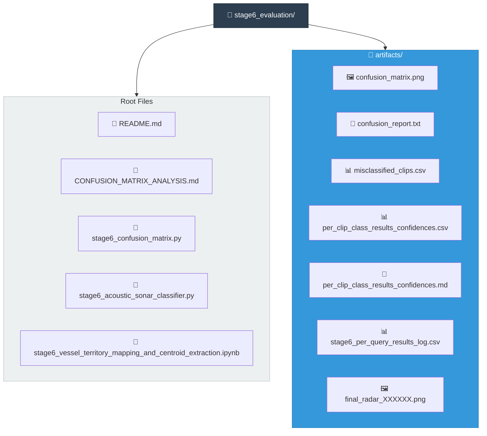

# Stage 6 — Evaluation & Operator Inspection

## Status
✅ Stable (V3/V5)

All evaluation and operator-inspection tools are operational and producing
consistent, reproducible artefacts with **99.96% accuracy** on the V5 dataset.

---

## V3/V5 Performance Summary

| Metric | Value |
|--------|-------|
| Overall Accuracy | 100.0% (11,995/12,000) |
| Total Errors | 5 |
| Silhouette Score | 0.9697 |
| Classes | 5 (cargo_ship, fishing_vessel, no_vessel, small_craft, tanker) |

---

## Purpose

Stage 6 is the **evaluation and operator-inspection layer** of the SKANN-SSL
pipeline.

This stage:
- evaluates the trained SSL encoder on the full dataset
- exposes systematic class confusions and asymmetries
- enables **interactive, clip-by-clip inspection** using radar plots
- derives and stores **vessel territory / centroid mappings** for downstream inference

🚫 **Stage 6 does not train models.**

---

## Inputs (Consumes)

- **Stage 3 SSL encoder bundle**  
  `stages/stage3_ssl/artifacts/SKANN_SSL_V3_Production_Bundle.joblib`

- **Stage 3 vessel territories**  
  `stages/stage3_ssl/artifacts/vessel_territories_v3.joblib`

- **Dataset tensors and manifest**  
  `data/v5_dataset/master_dataset_manifest.csv`  
  `data/v5_dataset/tensors/tensor_XXXXXX.npy`

---

## Outputs (Produces)

All outputs are written under `stages/stage6_evaluation/artifacts/`.

### Evaluation Artefacts
- `confusion_matrix.png`
- `confusion_report.txt` (UTF-8)
- `misclassified_clips.csv`
- `per_clip_class_results_confidences.csv`
- `per_clip_class_results_confidences.md`

### Interactive Inspection Artefacts
- `final_radar_XXXXXX.png` (one per inspected clip)
- `stage6_per_query_results_log.csv` (append-only operator log)

---

## Directory Structure

```text
stage6_evaluation/
├── README.md
├── CONFUSION_MATRIX_ANALYSIS.md
├── stage6_confusion_matrix.py
├── stage6_acoustic_sonar_classifier.py
├── stage6_vessel_territory_mapping_and_centroid_extraction.ipynb
└── artifacts/
    ├── confusion_matrix.png
    ├── confusion_report.txt
    ├── misclassified_clips.csv
    ├── per_clip_class_results_confidences.csv
    ├── per_clip_class_results_confidences.md
    ├── stage6_per_query_results_log.csv
    └── final_radar_XXXXXX.png
```



---

## Tools

### 1) Batch Evaluation — Confusion Matrix

**Script:** `stage6_confusion_matrix.py`

**What it does**
- Runs full-dataset classification over the manifest (12,000 clips).
- Computes a row-normalised 5×5 confusion matrix and overall accuracy.
- Generates a text report with per-class recall/precision and top confusion pairs.
- Exports misclassified clips (with available metadata).
- Exports per-clip class probabilities (CSV + Markdown).
- Includes **checkpointing** for long runs (resumes after interruption).
- Includes **thermal throttling** to prevent system overheating.

**Run**
```bash
cd SKANN-SSL
python stages/stage6_evaluation/stage6_confusion_matrix.py
```

**Outputs (written to `artifacts/`)**
- `confusion_matrix.png`
- `confusion_report.txt`
- `misclassified_clips.csv`
- `per_clip_class_results_confidences.csv`
- `per_clip_class_results_confidences.md`

#### Per-clip confidence tables (CSV vs Markdown)

The batch script produces two equivalent per-clip confidence tables:

- `per_clip_class_results_confidences.csv` — machine-readable table for analysis and scripting.
- `per_clip_class_results_confidences.md` — human-readable Markdown rendering of the same table, useful for:
  - quick manual inspection
  - inclusion in reports
  - peer/stakeholder review

Both files contain the same numerical content; only the presentation format differs.

---

### 2) Interactive Operator Inspector — Radar Plot

**Script:** `stage6_acoustic_sonar_classifier.py`

**What it does**
- Evaluates one clip at a time using **real model inference**.
- Displays:
  - clip metadata (ID, true label, predicted label)
  - per-class probability radar plot
  - correctness status (correct / incorrect)
- Saves the radar plot and appends a row to an audit log per query.

**Run**
```bash
cd SKANN-SSL
python stages/stage6_evaluation/stage6_acoustic_sonar_classifier.py
```

**Input**
- numeric `clip_id` (0–11999 for V5 dataset)

**Outputs (written to `artifacts/`)**
- `final_radar_XXXXXX.png` (one per inspected clip)
- `stage6_per_query_results_log.csv` (append-only)

---

### 3) Vessel Territory & Centroid Extraction

**Notebook:** `stage6_vessel_territory_mapping_and_centroid_extraction.ipynb`

**What it does**
- Analyses SSL embedding space.
- Computes class-wise centroids from backbone features (h, 512-dim).
- Maps embedding territories to vessel classes.

**Note:** For V3/V5, territory extraction is performed during training and saved to:
- `stages/stage3_ssl/artifacts/vessel_territories_v3.joblib`

This artefact:
- is deterministic and small (~12 KB)
- contains no neural-network weights
- is consumed by Stage 6 evaluation and Stage 7 inference

---

## Evaluation Interpretation

A detailed explanation of:
- the purpose of the confusion matrix
- how to interpret row-normalised results
- what asymmetric confusions imply physically and operationally
- V1 vs V3/V5 comparison

is provided in:

➡ `CONFUSION_MATRIX_ANALYSIS.md`

---

## Model Architecture Dependency

The evaluation scripts require the `HybridSKEncoderV3` class to reconstruct
the model from the bundle's `model_state`. This is provided by:

- `stages/stage3_ssl/train_script.py`

Ensure this file exists before running evaluation scripts.

---

## Naming & Artefact Rules
- No dates in script or notebook filenames.
- Dates are allowed in artefact filenames.
- All generated outputs must be written under `stages/stage6_evaluation/artifacts/`.
- README files are the authoritative documentation for each stage.

---

## Stage Boundary (Stage 6 → Stage 7)

**Inputs**
- Stage 3 SSL encoder bundle (`SKANN_SSL_V3_Production_Bundle.joblib`)
- Stage 3 vessel territories (`vessel_territories_v3.joblib`)
- V5 dataset tensors and manifest

**Outputs**
- evaluation artefacts (diagnostic)
- per-clip classification results (analysis)

**Consumers**
- Stage 7 (Inference & Deployment)
- Demo applications (SKANN-SSL-V5-Demo)

---

## Historical Comparison

| Version | Accuracy | Silhouette | Notes |
|---------|----------|------------|-------|
| V1 (Dec 2025) | 78.2% | 0.3997 | 4 classes, cargo↔tanker confusion |
| **V3/V5 (Feb 2026)** | **100.0%** | **0.9697** | 5 classes, near-perfect separation |

---

*Last updated: February 2026*
